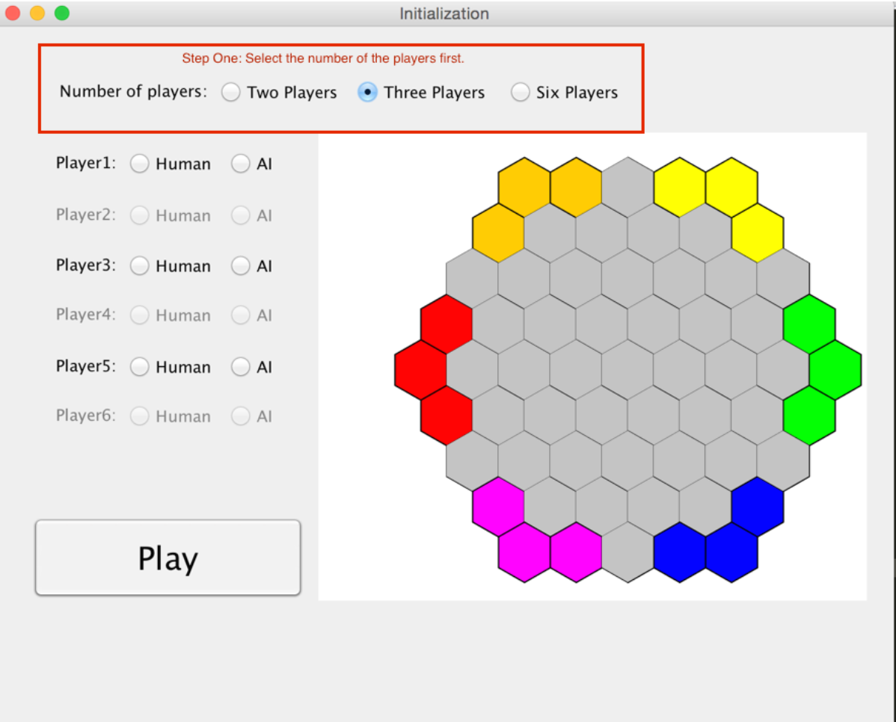
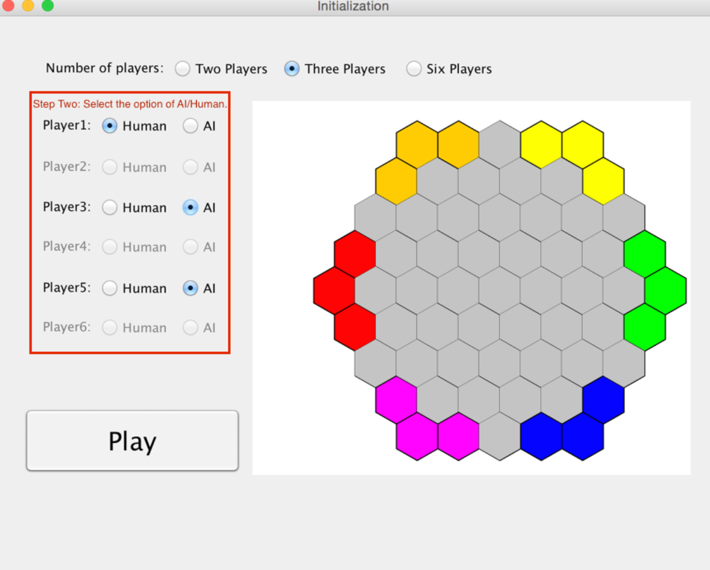
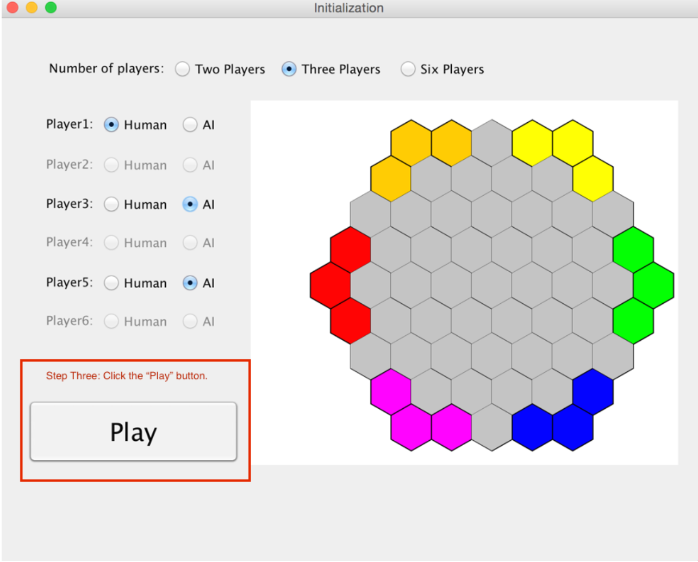
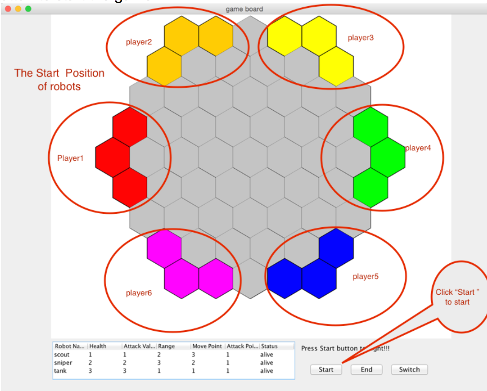
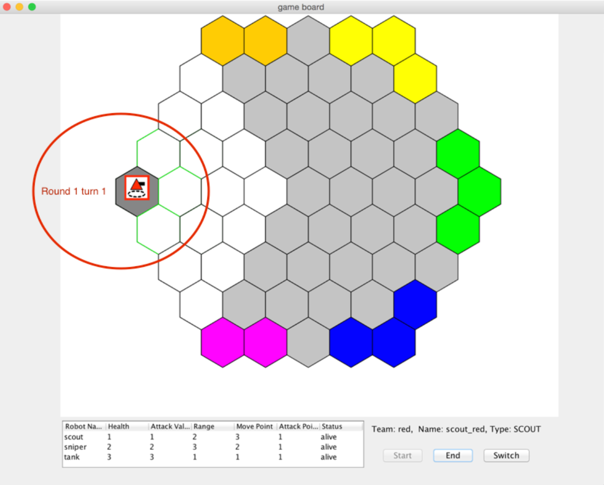
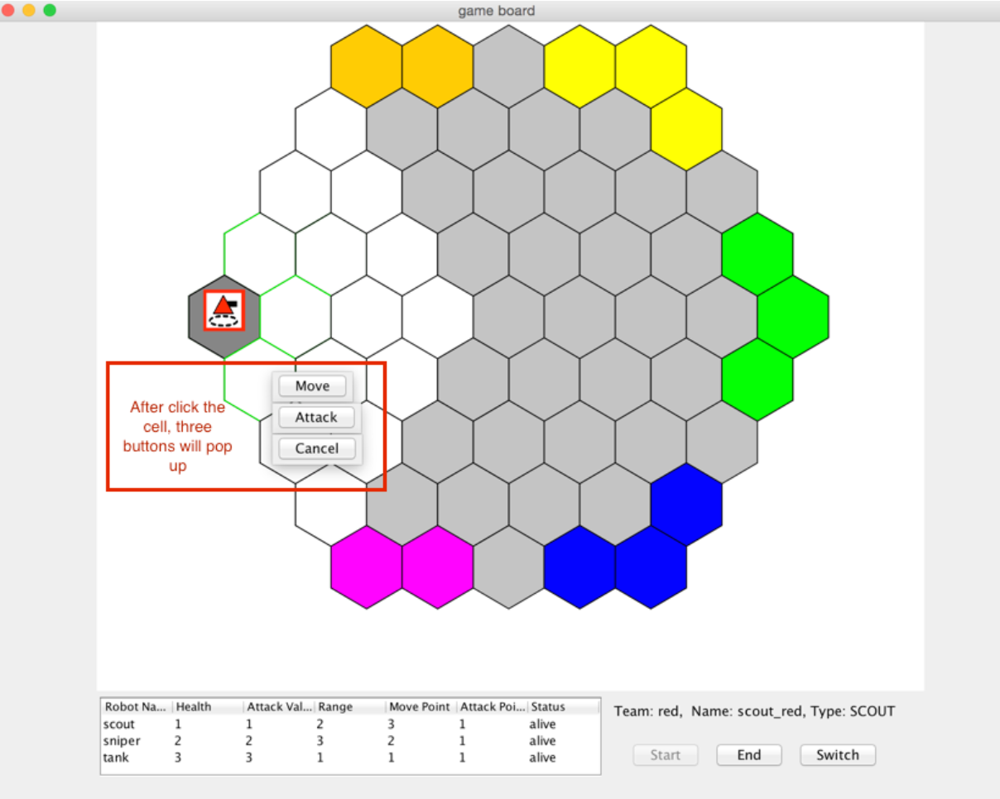
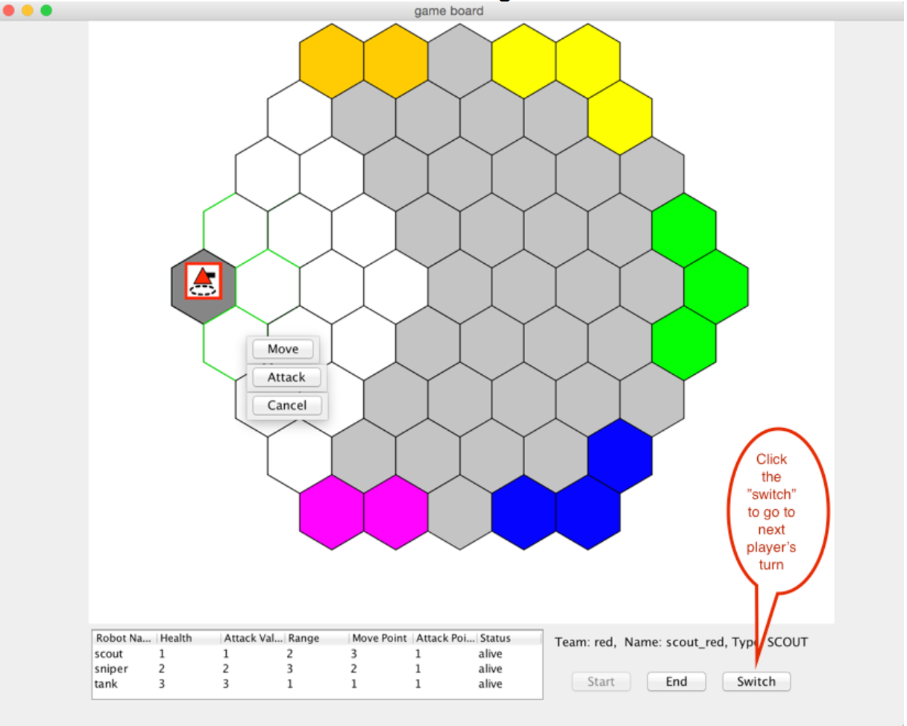
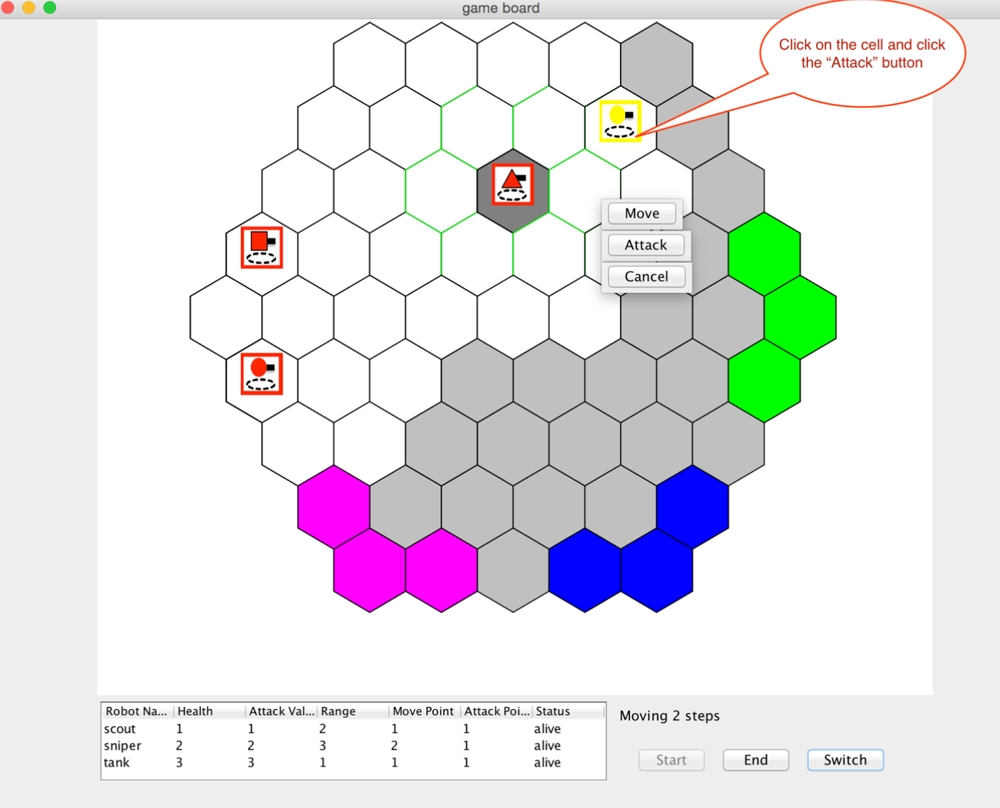
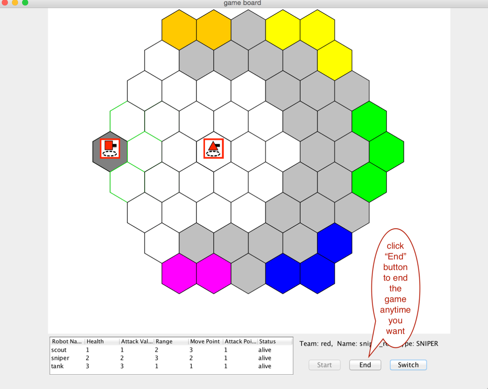

# Introduction:
This game is brought to you by a group of passionate programmers called team B3 from class CMPT370 in University of Saskatchewan as a class project.
This is a computer-based board game of strategy and wits. It pits up to 6 teams of robots against each other in a battle to the death. The team who defeats all other team's robots with any number of their robots surviving becomes the victor! In contrast to traditional board game, we take advantage of computer to automate some functions that cannot be realized by physical board game and we also added AI option for people who just cannot find partner to play with.

# How to play: 

